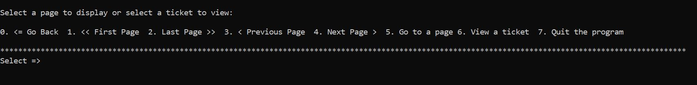

# Project Title

### Zendesk Ticket Viewer

# Project Description

A nodejs CLI application that queries Zendesk API to get a json file of 100 support tickets. The application will display all the tickets as well as to let the user view one individual ticket.

<p></p>

# Tech Tools Used

- node.js
- dotenv
- axios
- readline-sync
- mocha & chai

# Installation

NodeJS Version: v10.15.3

Refer to the link to install node.js https://nodejs.org/en/download/

**Initialize the application**

```
npm install
```

**Run the application**

```
node app.js
```

# Dependencies

- ### **dotenv**

  A zero-dependency module that loads environment variables from a .env file. Install dotenv to keep credentials from uploading to GitHub.

  **To run this application, a .env file needs to be setup in the root directory with the authentication credentials. I understand that the .env file should be in the gitignore file preventing it from uploading to GitHub to be viewed by the public as it contains sensitive information. However, I uploaded this file with my final commit so that the Zendesk Team can get the application running easily.**

* ### **axios**

  Used to make http get requests from node.js. axios automatic transforms for JSON data.

* ### **readline-sync**

  Used to interact with the user via a console. It displays a query to the user, then returns the input from the user after it has been typed and the Enter key was pressed.

* ### **Mocha & Chai**

  Mocha is a testing framework and Chai is an assertion library. Install Mocha and Chai as devDependencies.

# Running the tests

To run the tests

```
npm test
```

#### Testing Notes:

I am new to writing tests for applications and have discovered a lot over the last week. I enjoyed the challenge of learning and trying different testing methods and exploring the depths of testing.

For this project, I have done testing for the Pagination class methods. I use the provided JSON file: tickets.json as the data set for the tests instead of calling the API. Tests have been written for when the user gives the expected inputs and also for the cases that unexpected inputs are received. A corresponded error message will display with suggested actions to take should any input be invalid.

#### Testing Results:

I wrote a total of 13 tests for this application of which all passed. However, when testing, the methods in the Pagination class run with the displaying of the ticket list and errors to the terminal. Therefore, the testing results are interrupted with method call results. For example, as seen from below screenshot, an error message is displayed on top of the terminal as it was called by the Pagination class method: goToPage() with the an invalid input from the testing data array.

I'm sure there is a way to solve this problem. I will keep working on finding a solution for it.

<p></p>

# How to use

The application will start with the default to display the list of the first 15 tickets. At the bottom of the list, a menu with eight options will show as well.

<p></p>

#### Pagination options

- 0: to go back to the page before diverted. When an error occurs or when users choose to view a single ticket, the terminal will be cleared to show the error message or the ticket. A user can use this option to go back to the page they were at before.
- 1: to go to the first page
- 2: to go to the last page
- 3: to go to the previous page
- 4: to go to the next page
- 5: to go to a page that the user specified

#### View an individual ticket option

- 6: to view a ticket. the console will be cleared to display this ticket. To go back to the page before diverted, select option 0.

#### Leave the program option

- 7: select to terminate the program.

#### Error Handling - An error will occur in the below situations:

- when a user fails to select an valid option from the default menu
- when a user requests a ticket or page that is outside the bounds of the tickets array
- when a user tries to go to a page that does not exist
- when a user tries to view a ticket that does not exist

when above user activities occur, an error message will be displayed with the corresponding error contents on top of the terminal. To go back to the tickets list page before diverted, select option 0.

# Additional Information

- The application has used async/await. It is part of ECMAScript 2017 and is not supported in Internet Explorer and older browsers.

# Author

Jing Li - jingli.claire@gmail.com
